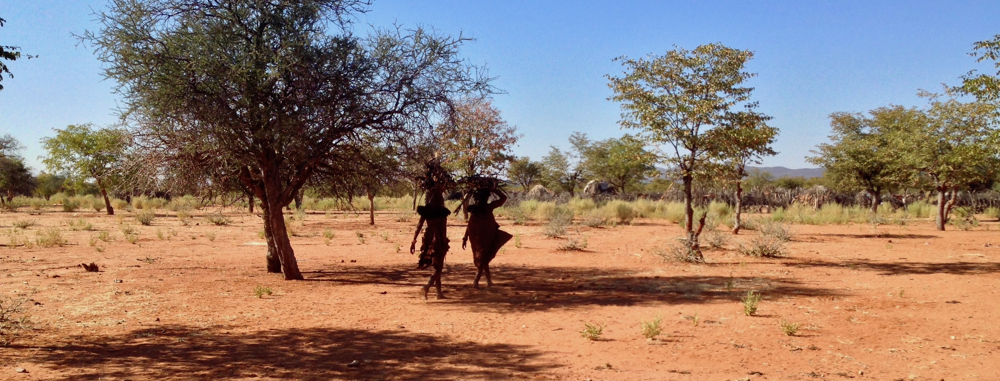

```{r, echo=FALSE,out.width = "110%"}

```

### Sean Prall

[Assistant Professor](https://anthropology.missouri.edu)  
[Department of Anthropology](https://anthropology.missouri.edu)  
[University of Missouri](https://anthropology.missouri.edu)  

I am an Assistant Professor and  evolutionary anthropologist at the University of Missouri with interests in human health and reproduction, reproductive decision making, and evolutionary ecology. In particular I examine costs and trade-offs associated with investments in reproduction. I do this with a combination of quantitative and qualitative methods, including anthropometrics, demography, endocrinology, actigraphy, validated health surveys, dyadic peer ratings, alongside semi-structured demographic interviews and measures of social norms. My work is informed by a mix of evolutionary and behavioral ecology, cultural evolutionary theory, and evolutionary psychology, especially they relate to reproductive concerns. I am also a co-director of the [Kunene Rural Health and Demography Project](http://krhdp.weebly.com), a contributor to the [ENDOW project](https://endowproject.github.io), and a collaborator on the [Shodagor Longitudinal Health and Demography Project](https://kathrinestarkweather.com/research-1).


### Publications

- Scelza BA, **Prall SP**. 2023. [Only death will separate us: the role of extramarital partnerships among Himba pastoralists](https://link.springer.com/article/10.1007/s10508-023-02553-2). *Archives of Sexual Behavior*.  [pdf](pubs/Scelza and Prall 2023 ASB.pdf) | [SI](pubs/Scelza and Prall 2023 ASB SI.pdf) | [data and code](https://osf.io/4q3ne/)

- Swinford NA, Gallagher B, Sheehama J, Lin M, **Prall SP**, Scelza BA, Henn BM. 2023. [Examination of runs of homozygosity in relation to height in an endogamous Namibian Population](https://onlinelibrary.wiley.com/doi/10.1002/ajpa.24660). *American Journal of Biological Anthropology* 180(1): 207-215.  [pdf](pubs/Swinford et al 2022.pdf) | [data and code](https://github.com/hennlab/HimbaHeight)

- **Prall SP**, Scelza BA. 2023. [The dietary impacts of drought in a traditional pastoralist economy](https://onlinelibrary.wiley.com/doi/10.1002/ajhb.23803). *American Journal of Human Biology* 35(1): e23803.  [pdf](pubs/Prall and Scelza 2022 AJHB.pdf)

- Swinford NA, **Prall SP**, Williams CM, Sheehama J, Scelza BA, Henn BM. preprint 2022. [Increased homozygosity due to endogamy results in fitness consequences in a human population](https://www.biorxiv.org/content/10.1101/2022.07.25.501261v1.article-info). *bioRxiv* 2022.07.25.501261. 

- **Prall SP**, Scelza BA. 2022. [The effect of mating market dynamics on partner preference and relationship quality among Himba pastoralists](https://www.science.org/doi/10.1126/sciadv.abm5629). *Science Advances* 8(18):eabm5629. [pdf](pubs/Prall and Scelza 2022 Sci Adv.pdf) | [SI](pubs/Prall and Scelza 2022 Sci Adv SI.pdf) | [code](https://osf.io/6wm3g/) | [MU Press Release](https://showme.missouri.edu/2022/relationships-are-best-between-people-of-similar-desirability-study-finds/)

- Starkweather KE, Keith MH, **Prall SP**, Alam N, tuz Zohora F, Thompson ME. 2021. [Are fathers a good substitute for mothers? Paternal care and growth rates in Shodagor children](https://onlinelibrary.wiley.com/doi/full/10.1002/dev.22148). *Developmental Psychobiology* 63(6): e22148. [pdf](pubs/Starkweather et al 2021.pdf) | [SI](pubs/Starkweather et al 2021 SI.pdf)

- Scelza BA, **Prall SP**, Starkweather KE. 2021. [The role of spousal separation on norms related to gender and sexuality among Himba pastoralists](https://www.mdpi.com/2076-0760/10/5/174). *Social Sciences* 10(5):174. [pdf](pubs/Scelza et al 2021.pdf) | [SI](pubs/Scelza et al 2021 SI.pdf)

- **Prall SP**, Scelza BA. 2020. [Resource demands reduce partner discrimination in Himba women](https://www.cambridge.org/core/journals/evolutionary-human-sciences/article/resource-demands-reduce-partner-discrimination-in-himba-women/E150ED1F386DA7FB8197FBAD4F212615). *Evolutionary Human Sciences* 2:E45.        [pdf](pubs/Prall and Scelza 2020 EHS.pdf) | [SI](pubs/Prall and Scelza 2020 EHS SI.pdf) 

- Broesch T, Crittenden AN, Beheim BA, Blackwell AD, Bunce JA, Colleran H, Hagel K, Kline M, McElreath R, Nelson RG, Pisor AC, **Prall SP**, Pretelli I, Purzycki B, Quinn EA, Ross C, Scelza B, Starkweather K, Stieglitz J, Borgerhoff-Mulder M. 2020. [Navigating cross-cultural research: methodological and ethical considerations](https://royalsocietypublishing.org/doi/10.1098/rspb.2020.1245). *Proceedings of the Royal Society B* 287:20201245.  [pdf](pubs/Broesch et al 2020.pdf) | [AAAS Press Release](https://www.eurekalert.org/pub_releases/2020-09/uonl-eci092220.php)

- Scelza BA, Atkinson E, **Prall SP**, McElreath R, Sheehama J, Henn BM. 2020. [The ethics and logistics of field-based paternity studies](https://doi.org/10.1017/ehs.2020.23). *Evolutionary Human Sciences* 2:E22 1-19.  [pdf](pubs/Scelza et al 2020 ehs.pdf) 

- **Prall SP**, Scelza BA. 2020. [Why men invest in non-biological offspring: paternal care and paternity confidence among Himba pastoralists](https://royalsocietypublishing.org/doi/10.1098/rspb.2019.2890). *Proceedings of the Royal Society B* 287:20192890.  [pdf](pubs/Prall and Scelza 2020.pdf) | [data and code](https://osf.io/bjkn8) | [SI](pubs/Prall and Scelza 2020 SI.pdf) |  [Conversation Piece](https://theconversation.com/the-deep-evolutionary-links-between-monogamy-and-fatherhood-are-more-complicated-than-we-thought-132660)

- Scelza BA, **Prall SP**, Swinford N, Gopalan S, Atkinson E, McElreath R, Sheehama J, Henn BM. 2020. [High rate of extra-pair paternity in a human population demonstrates diversity in human reproductive strategies](https://advances.sciencemag.org/content/6/8/eaay6195). *Science Advances* 6(8): eaa6195.   [pdf](pubs/Scelza et al 2020 sci adv.pdf) | [code](https://github.com/rmcelreath/Himba_EPP) |  [SI](pubs/Scelza et al 2020 sci adv SI.pdf) | [UCLA Press Release](https://newsroom.ucla.edu/releases/African-society-human-paternity-infidelity) | [Conversation Piece](https://theconversation.com/the-deep-evolutionary-links-between-monogamy-and-fatherhood-are-more-complicated-than-we-thought-132660)

- Scelza BA, **Prall SP**, Starkweather K. 2020. [Paternity and social obligations explain men's allocations to romantic partners in an experimental giving game](https://www.sciencedirect.com/science/article/abs/pii/S1090513819301928). *Evolution and Human Behavior* 41: 96-102.    [pdf](pubs/Scelza et al 2020 ehb.pdf) | [data and code](https://osf.io/8bp5z/) | [SI](pubs/Scelza et al 2020 ehb SI.pdf)

- Scelza BA, **Prall SP**, Blumenfeld T, Crittenden AN, Gurven M, Kline M, Koster J, Kuschnik G, Mattison SM, Pillsworth E, Shenk MK, Starkweather K, Stieglitz J, Sum CY, Yamaguchi K, McElreath R. 2020. [Patterns of paternal investment predict cross-cultural variation in jealous response](https://www.nature.com/articles/s41562-019-0654-y). *Nature Human Behaviour* 4: 20-26.  [pdf](pubs/Scelza et al 2019 Jealousy.pdf) | [data and code](https://osf.io/x593j/) | [SI](pubs/Scelza et al 2019 Jealousy SI.pdf) |  [UCLA Press Release](http://newsroom.ucla.edu/releases/new-study-led-by-ucla-anthropologist-suggests-that-in-societies-where-dads-are-more-involved-with-their-kids-responses-to-infidelity-are-more-severe)

- Scelza BA, **Prall SP**, Levine N. 2019. [The disequilibrium of double descent: changing inheritance norms among Himba pastoralists](https://royalsocietypublishing.org/doi/full/10.1098/rstb.2018.0072). *Philosophical Transactions of the Royal Society B* 374:20180072. [pdf](pubs/Scelza et al 2019 matriliny.pdf) | [data and code](https://osf.io/z4eb2/) | [SI](pubs/Scelza et al 2019 matriliny SI.pdf) 

- **Prall SP**, Yetish G, Scelza BA, Siegel JM. 2018. [The influence of age and sex specific labor demands on sleep in Namibian agro-pastoralists](https://www.sleephealthjournal.org/article/S2352-7218(18)30179-7/abstract). *Sleep Health* 4(6): 500-508.    [pdf](pubs/Prall et al sleep health.pdf)

- Scelza BA, **Prall SP**. 2018. [Partner preferences in the context of concurrency: what Himba want in formal and informal partners](https://www.sciencedirect.com/science/article/pii/S1090513817301186). *Evolution and Human Behavior* 39:212-219.  [pdf](pubs/Scelza and Prall 2018.pdf) | [data and code](https://data.mendeley.com/datasets/sstyj8n5ks/1) | [SI](pubs/Scelza and Prall 2018 SI.pdf)   

- Longman D, **Prall SP**, Shattuck EC, Stephen ID, Stock JT, Wells JCK, Muehlenbein MP. 2018. [Short-term resource allocation during extensive athletic competition](https://onlinelibrary.wiley.com/doi/full/10.1002/ajhb.23052). *American Journal of Human Biology* 30: e23052. [pdf](pubs/Longman et al 2017.pdf)

- **Prall SP**, Muehlenbein MP. 2018. [DHEA modulates immune function: a review of the evidence](https://www.sciencedirect.com/science/article/pii/S0083672918300347). In: G Litwack (ed), *Dehydroepiandrosterone*. Elsevier Press. [pdf](pubs/Prall and Muehlenbein ch 2018.pdf)

- Tieder JS, **Prall SP**, Beck J, Alberda E, Jensen D, Nair D, Carline JD. 2017. [A survey of perceived effectiveness of Part 4 Maintenance of Certification](https://hosppeds.aappublications.org/content/7/11/642.figures-only). *Hospital Pediatrics*, 7(11): 642-648.

- **Prall SP**, Scelza BA. 2017. [Child fosterage and sex-biased nutritional outcomes among Namibian Pastoralists](https://onlinelibrary.wiley.com/doi/abs/10.1002/ajhb.23058). *American Journal of Human Biology* 29(6): e23058.   [pdf](pubs/Prall and Scelza 2017.pdf) | [SI](pubs/Prall and Scelza 2017 SI.pdf)

- Hodges-Simeon CR, **Prall SP**, Blackwell A, Gurven M, Gaulin SJC. 2017. [Adrenal maturation, nutritional status and mucosal immunity in Bolivian youth](https://onlinelibrary.wiley.com/doi/abs/10.1002/ajhb.23025). *American Journal of Human Biology* 29(5): e23025.  [pdf](pubs/Hodges-Simeon et al 2017.pdf)

- **Prall SP**, Larson EE, Muehlenbein MP. 2017. [The role of dehydroepiandrosterone on functional innate immune responses to acute stress](https://onlinelibrary.wiley.com/doi/abs/10.1002/smi.2752). *Stress and Health* 33:656-664. [pdf](pubs/Prall et al stress and health.pdf)

- **Prall SP**, Muehlenbein MP. 2017. Hormonal correlates of dominance. In: A Fuentes (ed), *International Encyclopedia of Primatology*, Wiley-Blackwell.  [pdf](pubs/Prall Muehlenbein Encyclopedia entry.pdf)

- Muehlenbein MP, **Prall SP**, Peck HN. 2017. Immunity, hormones and life history trade-offs. In: Jasienska G, Sherry DS, Holmes DJ (eds). *The Arc of Life: Evolution and health over the life course*. Springer Press, p. 99-120.   [pdf](pubs/Muehlenbein et al 2017.pdf)

- **Prall SP**, Muehlenbein MP. [Dehydroepiandrosterone and multiple measures of functional immunity in young adults](https://onlinelibrary.wiley.com/doi/10.1002/ajhb.22724). 2015. *American Journal of Human Biology* 27(6):877-880. [pdf](pubs/Prall and Muehlenbein 2015.pdf)

- Georgiev AV, Muehlenbein M, **Prall SP**, Emery-Thompson M, Maestripieri D. 2015. [Male quality, dominance rank and mating success in free-ranging rhesus macaques](https://academic.oup.com/beheco/article/26/3/763/234197). *Behavioral Ecology* 26(3):763-772. [pdf](pubs/Georgiev et al. 2015.pdf)

- **Prall SP**, Ambu L, Nathan S, Alsisto S, Ramirez D, Muehlenbein MP. 2015. [Androgens and innate immunity in rehabilitated semi-captive Orangutans (Pongo pygmaeus morio)](https://onlinelibrary.wiley.com/doi/abs/10.1002/ajp.22387). *American Journal of Primatology* 77(6):642-650. [pdf](pubs/Prall et al. 2015 AJP.pdf)

- Muehlenbein MP, Pacheco MA, Taylor JE, **Prall SP**, Ambu L, Nathan S, Alsisto S, Ramirez D, Escalante AA. 2015. [Accelerated diversification of non-human primate malarias in Southeast Asia: adaptive radiation or geographic speciation?](https://www.ncbi.nlm.nih.gov/pmc/articles/PMC4298170/) *Molecular Biology and Evolution* 32(2):422-439.  [pdf](pubs/Muehlenbein et al. 2015.pdf)

- **Prall SP**, Muehlenbein MP. 2014. [Testosterone and immune function in primates: A brief summary with methodological considerations](https://link.springer.com/article/10.1007/s10764-014-9752-x). *International Journal of Primatology* 35(3-4): 805-824. [pdf](pubs/Prall and Muehlenbein 2014 IJP.pdf)

-	Muehlenbein MP, Ancrenaz M, Sakong R, Ambu L, **Prall SP**, Fuller G, Raghanti MA. 2012. [Ape conservation physiology: Fecal glucocorticoid responses in wild Pongo pygmaeus morio following human visitation](https://journals.plos.org/plosone/article?id=10.1371/journal.pone.0033357). *PLoS ONE* 7(3): e33357.  [pdf](pubs/Muehlenbein et al. 2012.pdf)

- Streeter M, **Prall SP**, Hill C. 2008. Paleohistological Study of Pleistocene Mammoth (*Mammuthus*) Bone. *Current Research in the Pleistocene* 25:189-191.


### Co-author Network
Visual network of co-authors and co-authored papers (inspired by [Elly Power](https://eapower.github.io)). 
```{r,echo=FALSE, fig.height = 4, fig.width = 6, fig.align = "center"}
library(visNetwork)
load(file="network")
sp_network
```

### Courses taught at Mizzou
- **Anthro 1000 - [Introduction to anthropology: biology, prehistory, and culture](pubs/Prall_Anthro1000.pdf)** - Anthropology is the study of humanity. As such, anthropology seeks to understand where humans come from and how they have evolved, how societies and cultures develop and change over time, and to understand modern cultural and behavioral diversity. Because of this broad approach, anthropology is inherently an interdisciplinary field, drawing from social and natural sciences, history, and linguistics. By combining these perspectives, with an emphasis on diversity and cultural variation, anthropology helps us understand how people live, adapt, and shape the world around them.  [syllabus](pubs/Prall_Anthro1000.pdf)
- **Anthro 1560 - [Outbreaks and the anthropology of emerging disease](pubs/Prall_outbreaks_syllabus.pdf)** - Human-environment interactions, and biocultural responses to illness profoundly impact the ways in which diseases evolve, emerge, and spread. Similarly, cultural responses to disease processes can have profound impacts on the evolution of cultural traits.  This course will explore the role of humans and cultural variation in emerging infectious diseases and disease outbreaks by focusing on the origins, emergence, spread, and response to Ebola, Rabies, HIV, COVID-19 and others. Additionally this course will explore the cultural evolution of resistance to treatment of infectious disease, including vaccine hesitancy in industrialized and developing countries, as well as stigma, misinformation, and distrust that often accompanies disease outbreaks. By focusing on the interplay between culture and ecology, this course will highlight the power of anthropological perspectives to understand human health in the context of contemporary infectious diseases.  [syllabus](pubs/Prall_outbreaks_syllabus.pdf)
- **Anthro 2580 - [Evolution of Human Sexuality](pubs/Prall_sex_syllabus.pdf)** - Sexual reproduction has been shaped by two billion years of evolution. In the human lineage, we carry biological and behavioral remnants of this evolution, but our own reproductive behaviors and decisions are also influenced by the cultural context. Ecology and social life shape variation in mating patterns cross-culturally, including sexual behavior, marriage, attraction, mate choice, jealousy, paternity, disease transmission, contraception, and interpretations of gender. By drawing from evolutionary history, non-human primates, small-scale societies, and industrialized nations, this course will critically evaluate understandings of human sexual behavior and reproduction from an evolutionary and anthropological perspective. [syllabus](pubs/Prall_sex_syllabus.pdf)
- **Anthro 4300/7300 - [Comparative Social Organization](pubs/Prall_comp_social_org_syllabus.pdf)** - This course explores the variation in social organization as studied by anthropologists. As part of this course, students will explore topics including kinship, marriage, family, decent and residence patterns, social networks, inequality, and the evolutionary and ecological approaches to understanding these topics. In the first part of the course, we will explore important concepts of kinship, decent, and residence, and marriage. The second part of the course will survey major patterns of social organization from both regional, historical, and topical perspectives. As part of this course students will read and analyze ethnographic descriptions of various populations, watch documentaries, and engage in discussions of course topics. By the end of the course students will have an understanding of how gender and kinship shape social structures and institutions. [syllabus](pubs/Prall_comp_social_org_syllabus.pdf)
- **Anthro 4580/7580 - [Evolutionary Medicine](pubs/Prall_evmed_syllabus.pdf)** - Evolutionary processes and human evolutionary history have profound implications in the way in which we respond and are susceptible to disease. Unlike many biomedical understandings of human health, evolution can better inform on the ultimate causes and consequences of topics such as infection and inflammation, allergy, parasites, diabetes and cardiovascular disease, aging, reproductive issues, and mental disorders. As part of this class, students will use evolution to critically evaluate human health, and explore how natural selection can shape behaviors and physiological responses. [syllabus](pubs/Prall_evmed_syllabus.pdf)


```{r, echo=FALSE,out.width = "110%"}
#
```

